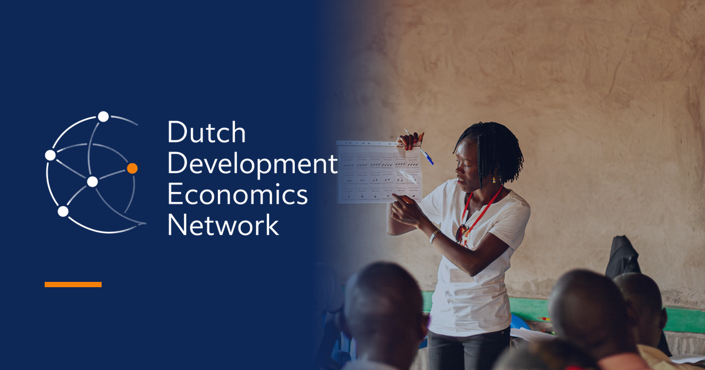

# Dutch Development Economics Network — website

This is the GitHub repository for the website of the Dutch Development Economics Network (DDEN).
On the website you can find:

- **Posts:** blog posts with summaries of members' on-going projects, visualisations, or similar.

- **Universities:** affiliated universities and their coordinators' contact information.

- **Members:** affiliated members and their contact information.

- **Events:** Descriptions of past, current, and future events hosted by the network.

**Brand assets:**

`images/sources/` holds the two masters — the logo and the uncropped hero photo — and everything
else under `images/` is generated from them by `python3 Python/make_assets.py`: the logo variants
(colour and white), the favicons, the hero crops, the link-preview card and the event thumbnail.
Change a colour or a caption in that script and re-run it rather than editing the output files.
The brand colours live in one place per file type: `custom_theme.scss` for the variables Bootstrap
needs, and the `:root` block at the top of `theme.css` for everything else.

**How to maintain the website:**

The website is currently maintained by [@michelleg06](https://github.com/michelleg06). If you have any suggestions, comments, or requests, feel free to reach out to her.
