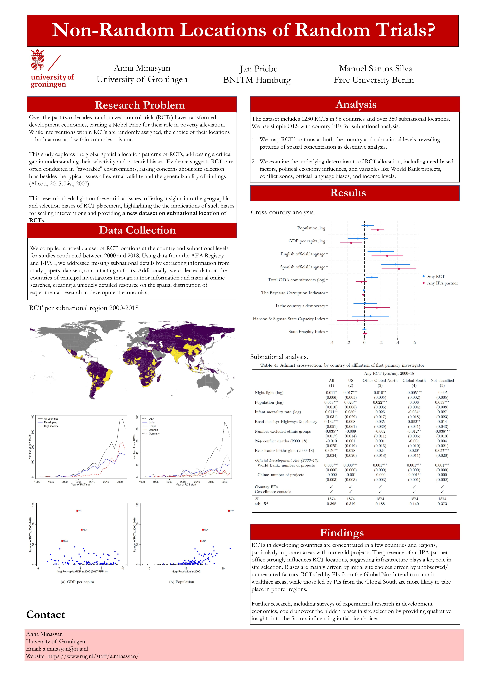
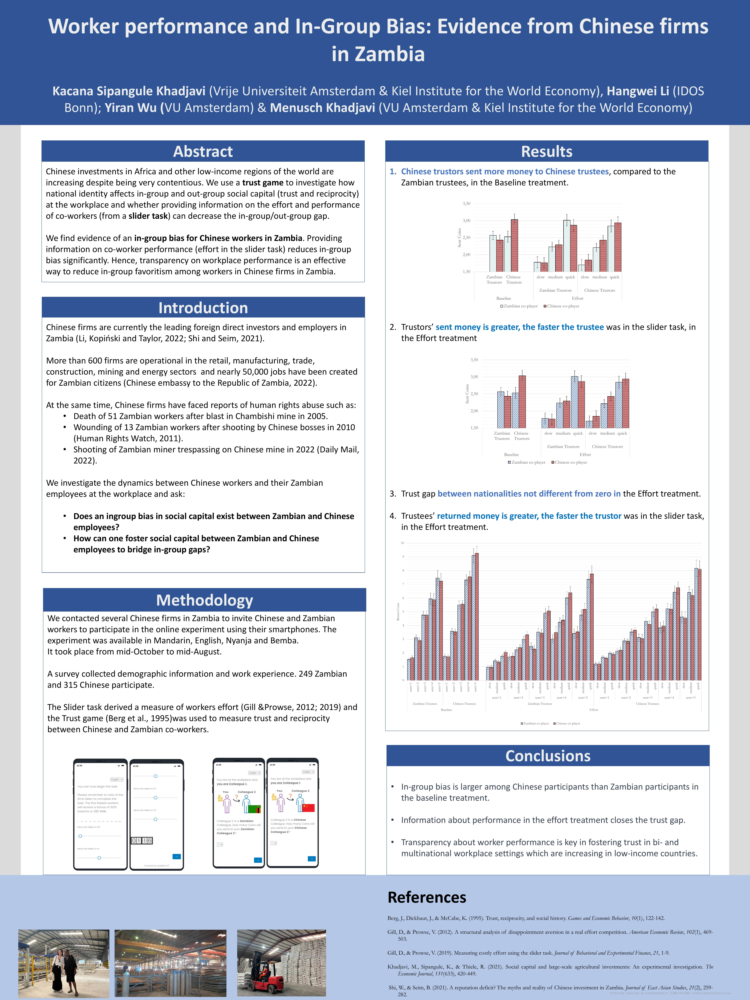
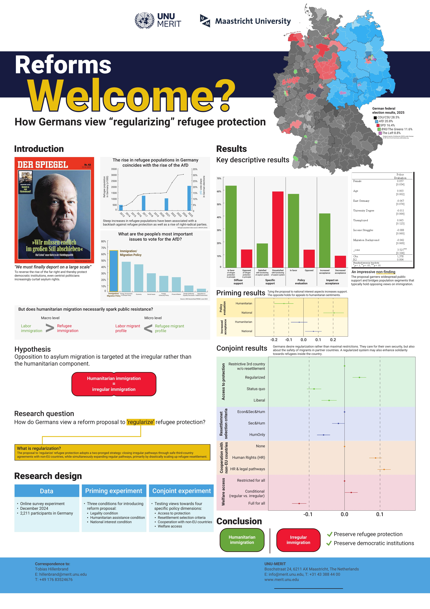
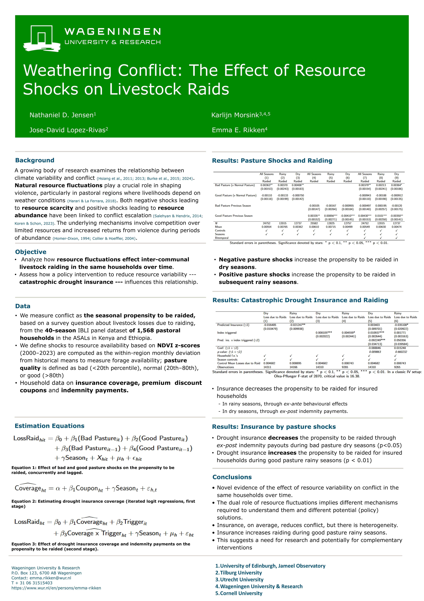
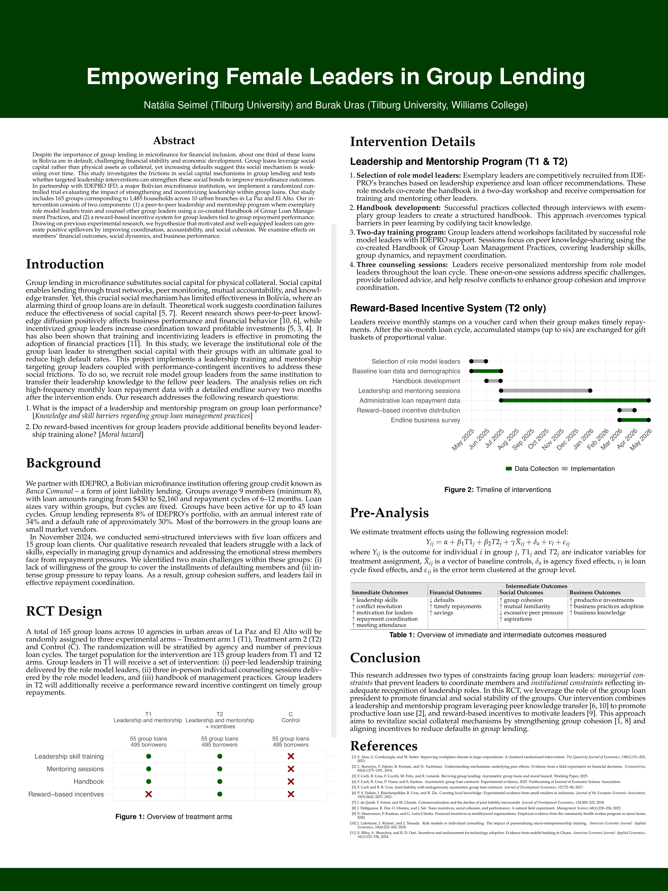
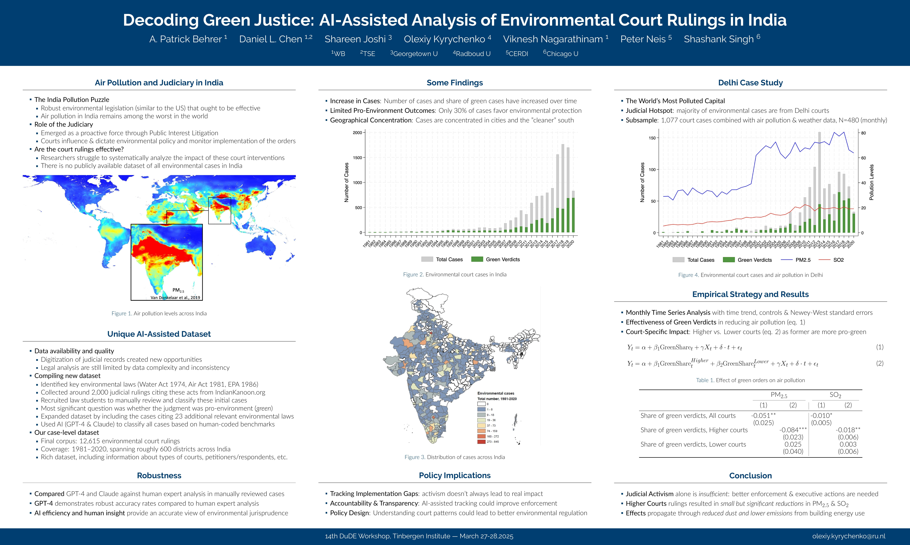

:::{.column-page}
::::{.paper-layout}

<!-- Side panel -->

:::{.paper-side-column}

<center>

<div style="text-align: center;">
  
</div>

**Tinbergen Institute**
(Graduate School and Research Institute for Economics and Business)

**Location**
📍 Gustav Mahlerplein 117, 1082 MS Amsterdam, The Netherlands.

```{r}
#| echo: false
#| output: true

library(leaflet)
leaflet() %>%
  addTiles() %>%
  addMarkers(lng = 4.873, lat = 52.339, popup = "Tinbergen Institute")
```

</center>

:::

<!-- Main column -->

:::{.paper-main-column}

```{css, echo = FALSE}
.justify {
  text-align: justify;
}
```

:::{.justify}

The 14th Dutch Development Economics Network (DuDE) Workshop was hosted by the Tinbergen Institute, in Amsterdam. Chaired by [Marc Witte](https://www.marcwitte.com/), the event took place on 27 and 28 March 2025 and included various academic and social activities, among which paper presentations, social lunches and dinner, and poster presentations. For a detailed version of the full itinerary, please download the [workshop program](program.pdf).

### Posters

Feel free to download the posters from the 14th iteration of the DuDE Workshop.

::: {.poster-grid}

:::{.poster-card}
[](posters/poster1_anna.pdf){title="Download poster (PDF)"}
**Anna Minasyan**
[Groningen University]{.poster-uni}
:::

:::{.poster-card}
[](posters/poster2_kacana.pdf){title="Download poster (PDF)"}
**Kacana Sipangule Khadjavi**
[VU Amsterdam]{.poster-uni}
:::

:::{.poster-card}
[](posters/poster4_tobias.pdf){title="Download poster (PDF)"}
**Tobias Hillebrand**
[UNU-MERIT]{.poster-uni}
:::

:::{.poster-card}
[](posters/poster5_rikken.pdf){title="Download poster (PDF)"}
**Emma E. Rikken**
[Wageningen University]{.poster-uni}
:::

:::{.poster-card}
[](posters/poster6_seimel.pdf){title="Download poster (PDF)"}
**Natália Seimel**
[Tilburg University]{.poster-uni}
:::

:::{.poster-card}
[](posters/poster3_kyrychenko.pdf){title="Download poster (PDF)"}
**Olexiy Kyrychenko**
[Radboud University]{.poster-uni}
:::

:::
:::
:::

::::
:::
