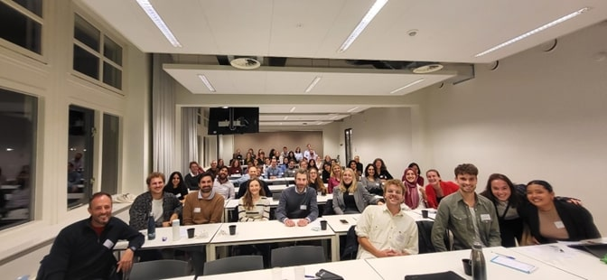
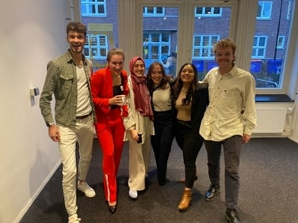
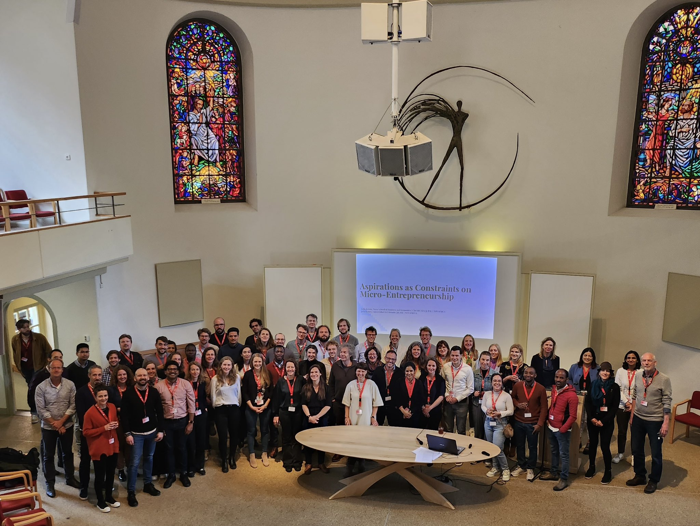
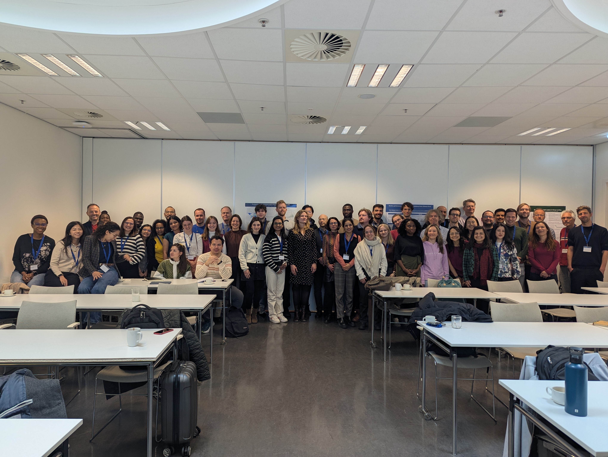
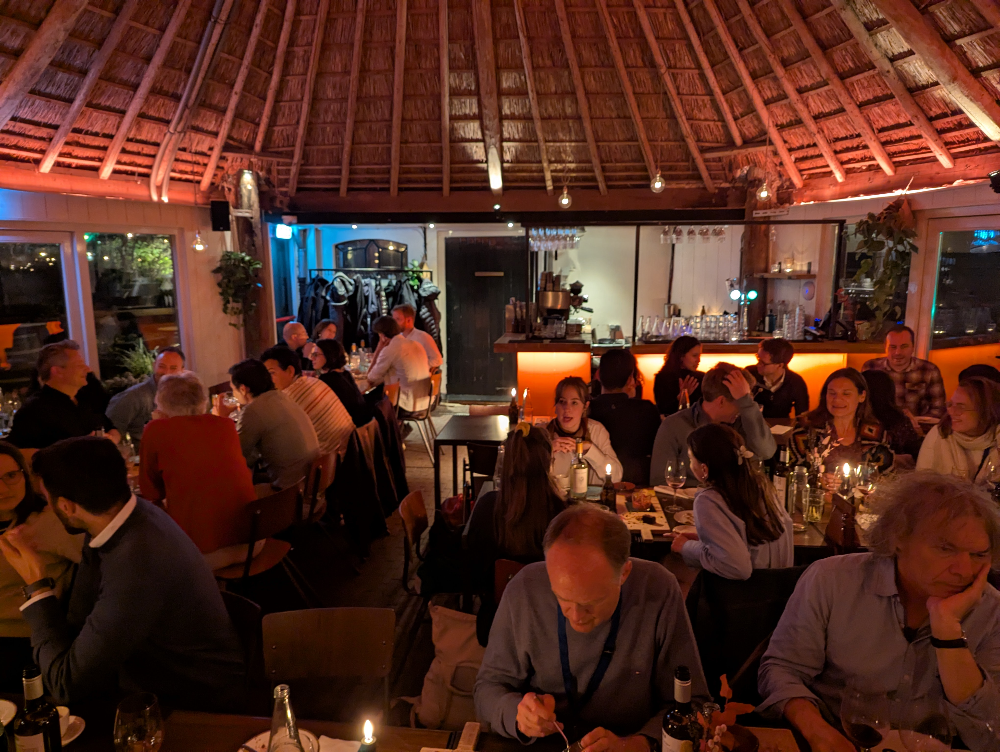

```{r}
#| include: false
library(htmltools)
```

::: {.home-intro}
[Our mission]{.mission-kicker}

[Facilitating knowledge exchange and connections among development economists based in the Netherlands.]{.mission-statement}

::: {.mission-support}
Our members are researchers from seven participating universities: Groningen, Nijmegen, Tilburg, UNU-MERIT, Utrecht, VU Amsterdam, and Wageningen. We organize two annual events — a general workshop and one dedicated to PhD students — and we are affiliated to the [European Development Economics Group](https://www.ede-group.org/).
:::
:::

::::: {.column-screen}
:::: {.home-split}

::: {.home-panel .home-panel-text}
### JOIN US

Connect with researchers in the Netherlands working on Development Economics. Seven participating universities take turns hosting engaging events where we share knowledge and new ideas in the field.

```{=html}
<div class="event-list">
  <p class="event-list-title">Upcoming events</p>
  <div class="event-row">
    <span class="event-when">Fall 2025</span>
    <span class="event-what">3rd PhD Workshop &middot; Tinbergen Institute</span>
  </div>
  <div class="event-row">
    <span class="event-when">Spring 2026</span>
    <span class="event-what">15th Workshop &middot; Nijmegen University</span>
  </div>
  <a class="btn-events" href="events/index.html">All events &rarr;</a>
</div>
```
:::

::: {.home-panel .home-panel-media}
<div class="gallery" id="home-gallery">
  
  
  
  
  
  <div class="gallery-dots" role="tablist" aria-label="Choose photo"></div>
  <button class="gallery-toggle" id="gallery-toggle" aria-label="Pause slideshow">
    <svg class="icon-pause" width="16" height="16" viewBox="0 0 24 24" fill="currentColor" aria-hidden="true"><path d="M7 5h4v14H7zM13 5h4v14h-4z"/></svg>
    <svg class="icon-play" width="16" height="16" viewBox="0 0 24 24" fill="currentColor" aria-hidden="true" style="display:none"><path d="M8 5v14l11-7z"/></svg>
  </button>
</div>
<p class="gallery-caption">Moments from past DuDE events, publicly shared by participants.</p>
:::

::::
:::::

<script>
(function () {
  const gallery = document.getElementById('home-gallery');
  const slides = gallery.querySelectorAll('.gallery-img');
  const dotsWrap = gallery.querySelector('.gallery-dots');
  const toggle = document.getElementById('gallery-toggle');
  const iconPause = toggle.querySelector('.icon-pause');
  const iconPlay = toggle.querySelector('.icon-play');
  const reducedMotion = window.matchMedia('(prefers-reduced-motion: reduce)').matches;

  let current = 0;
  let timer = null;

  slides.forEach((_, i) => {
    const dot = document.createElement('button');
    dot.className = 'gallery-dot';
    dot.setAttribute('aria-label', 'Show photo ' + (i + 1));
    dot.addEventListener('click', () => { goTo(i); if (timer) restart(); });
    dotsWrap.appendChild(dot);
  });
  const dots = dotsWrap.querySelectorAll('.gallery-dot');

  function goTo(i) {
    slides[current].classList.remove('active');
    dots[current].classList.remove('active');
    current = i;
    slides[current].classList.add('active');
    dots[current].classList.add('active');
  }

  function next() { goTo((current + 1) % slides.length); }

  function setToggle(playing) {
    iconPause.style.display = playing ? '' : 'none';
    iconPlay.style.display = playing ? 'none' : '';
    toggle.setAttribute('aria-label', playing ? 'Pause slideshow' : 'Play slideshow');
  }

  function start() { timer = setInterval(next, 4000); setToggle(true); }
  function stop() { clearInterval(timer); timer = null; setToggle(false); }
  function restart() { clearInterval(timer); timer = setInterval(next, 4000); }

  toggle.addEventListener('click', () => { timer ? stop() : start(); });

  goTo(0);
  if (reducedMotion) { setToggle(false); } else { start(); }
})();
</script>

::::: {.column-screen .home-explore}

<div class="home-explore-inner">

## Explore DuDE

<p class="explore-sub">Blog posts with research highlights, our events, and the people behind the network.</p>

```{r}
#| echo: false
tags$div(class = "category-row",

  # Posts
  tags$div(class = "category-column",
    tags$a(href = "posts/blog/index.html",
      tags$img(
        src = "images/vectors/book.svg",
        alt = "Blog posts",
        class = "category-image honey-white"
      )
    ),
    tags$h4(style = "text-align:center;",
      tags$a(
        class = "white",
        href = "posts/blog/index.html",
        "Posts"
      )
    )
  ),

  # Affiliated Universities
  tags$div(class = "category-column",
    tags$a(href = "members/universities/index.html",
      tags$img(
        src = "images/vectors/nl.svg",
        alt = "Affiliated universities",
        class = "category-image honey-white"
      )
    ),
    tags$h4(style = "text-align:center;",
      tags$a(
        class = "white",
        href = "members/universities/index.html",
        "Affiliated Universities"
      )
    )
  ),

  # Events
  tags$div(class = "category-column",
    tags$a(href = "events/index.html",
      tags$img(
        src = "images/vectors/events.svg",
        alt = "Events",
        class = "category-image honey-white"
      )
    ),
    tags$h4(style = "text-align:center;",
      tags$a(
        class = "white",
        href = "events/index.html",
        "Events"
      )
    )
  )
)
```

</div>

:::::
