```{=html}
<div class="member-filter" role="group" aria-label="Filter members by institution">
  <button class="member-chip active" data-filter="all">All</button>
  <button class="member-chip" data-filter="erasmus">Erasmus</button>
  <button class="member-chip" data-filter="groningen">Groningen</button>
  <button class="member-chip" data-filter="radboud">Radboud</button>
  <button class="member-chip" data-filter="tilburg">Tilburg</button>
  <button class="member-chip" data-filter="tinbergen">Tinbergen</button>
  <button class="member-chip" data-filter="unu-merit">UNU-MERIT</button>
  <button class="member-chip" data-filter="utrecht">Utrecht</button>
  <button class="member-chip" data-filter="vu">VU Amsterdam</button>
  <button class="member-chip" data-filter="wageningen">Wageningen</button>
</div>

<h3 class="members-h">Faculty</h3>

<div class="member-grid">

  <div class="member-card" data-uni="wageningen">
    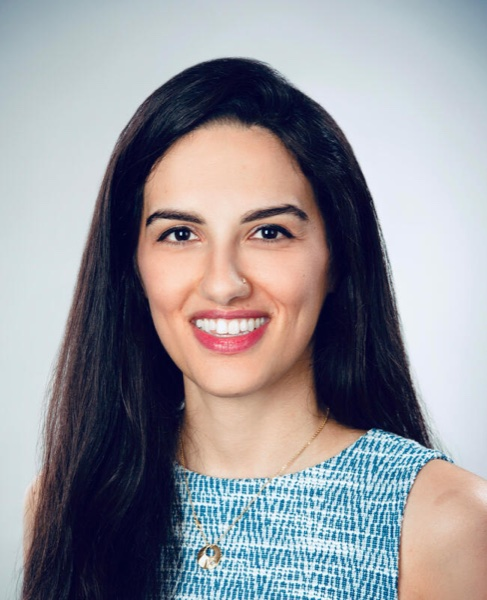
    <h4 class="member-name">Amal Ahmad</h4>
    <p class="member-uni">Wageningen University</p>
    <a class="member-link" href="https://amalahmad.net/" target="_blank" rel="noopener" title="Personal page" aria-label="Personal page of Amal Ahmad">
      </a>
  </div>

  <div class="member-card" data-uni="wageningen">
    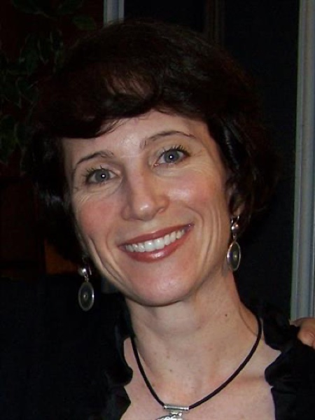
    <h4 class="member-name">Jenny Aker</h4>
    <p class="member-uni">Wageningen University</p>
    <a class="member-link" href="https://sites.tufts.edu/jennyaker/" target="_blank" rel="noopener" title="Personal page" aria-label="Personal page of Jenny Aker">
      </a>
  </div>

  <div class="member-card" data-uni="erasmus">
    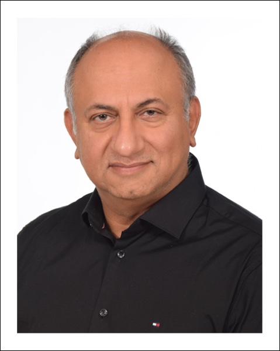
    <h4 class="member-name">Arjun S. Bedi</h4>
    <p class="member-uni">ISS, Erasmus University Rotterdam</p>
    <a class="member-link" href="https://www.eur.nl/en/people/arjun-bedi" target="_blank" rel="noopener" title="Personal page" aria-label="Personal page of Arjun S. Bedi">
      </a>
  </div>

  <div class="member-card" data-uni="groningen">
    
    <h4 class="member-name">Dirk Bezemer</h4>
    <p class="member-uni">University of Groningen</p>
    <a class="member-link" href="https://www.rug.nl/staff/d.j.bezemer/" target="_blank" rel="noopener" title="Personal page" aria-label="Personal page of Dirk Bezemer">
      </a>
  </div>

  <div class="member-card" data-uni="erasmus">
    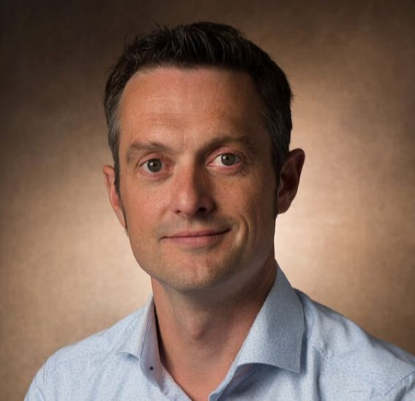
    <h4 class="member-name">Maarten Bosker</h4>
    <p class="member-uni">Erasmus University Rotterdam</p>
    <a class="member-link" href="https://www.eur.nl/en/people/maarten-bosker" target="_blank" rel="noopener" title="Personal page" aria-label="Personal page of Maarten Bosker">
      </a>
  </div>

  <div class="member-card" data-uni="wageningen">
    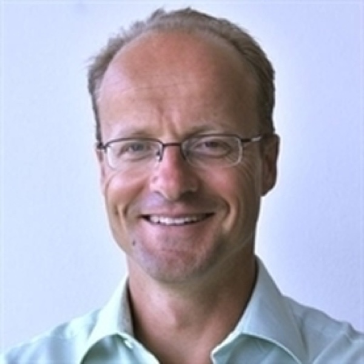
    <h4 class="member-name">Erwin Bulte</h4>
    <p class="member-uni">Wageningen University</p>
    <a class="member-link" href="https://www.wur.nl/en/persons/erwin-bulte.htm" target="_blank" rel="noopener" title="Personal page" aria-label="Personal page of Erwin Bulte">
      </a>
  </div>

  <div class="member-card" data-uni="wageningen">
    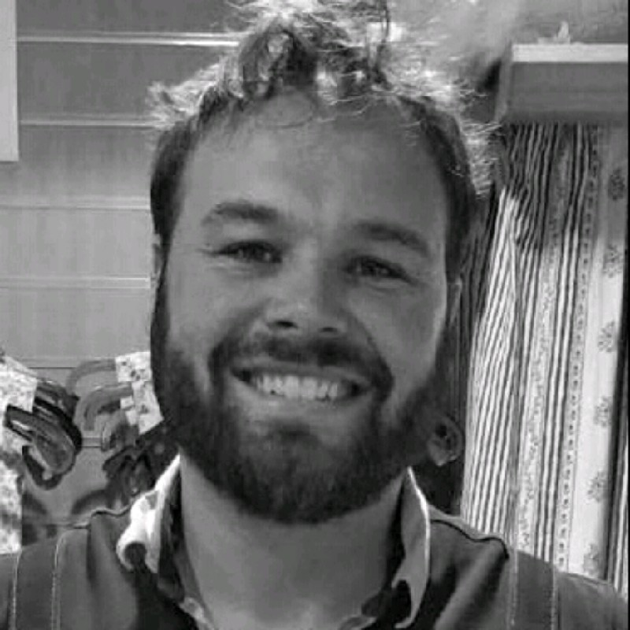
    <h4 class="member-name">Francesco Cecchi</h4>
    <p class="member-uni">Wageningen University</p>
    <a class="member-link" href="https://sites.google.com/view/francescocecchi" target="_blank" rel="noopener" title="Personal page" aria-label="Personal page of Francesco Cecchi">
      </a>
  </div>

  <div class="member-card" data-uni="erasmus">
    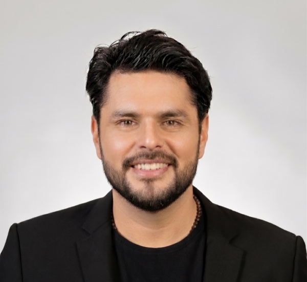
    <h4 class="member-name">John Cruzatti</h4>
    <p class="member-uni">Erasmus University Rotterdam</p>
    <a class="member-link" href="https://www.johncruzatti.com/" target="_blank" rel="noopener" title="Personal page" aria-label="Personal page of John Cruzatti">
      </a>
  </div>

  <div class="member-card" data-uni="groningen">
    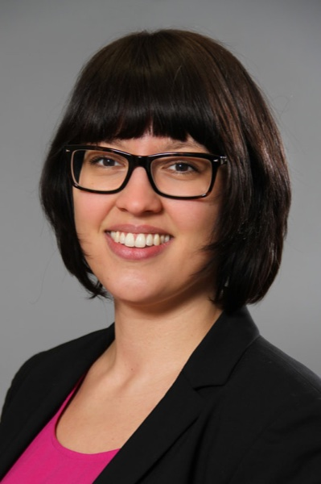
    <h4 class="member-name">Kristina Czura</h4>
    <p class="member-uni">University of Groningen</p>
    <a class="member-link" href="https://sites.google.com/site/kristinaczura" target="_blank" rel="noopener" title="Personal page" aria-label="Personal page of Kristina Czura">
      </a>
  </div>

  <div class="member-card" data-uni="tilburg">
    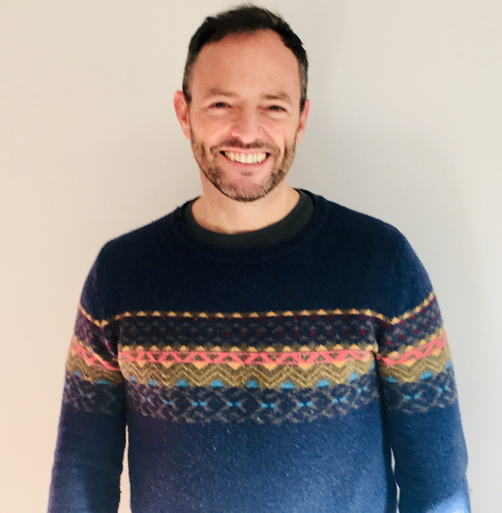
    <h4 class="member-name">Patricio Dalton</h4>
    <p class="member-uni">Tilburg University</p>
    <a class="member-link" href="https://sites.google.com/site/psdalton/home" target="_blank" rel="noopener" title="Personal page" aria-label="Personal page of Patricio Dalton">
      </a>
  </div>

  <div class="member-card" data-uni="erasmus">
    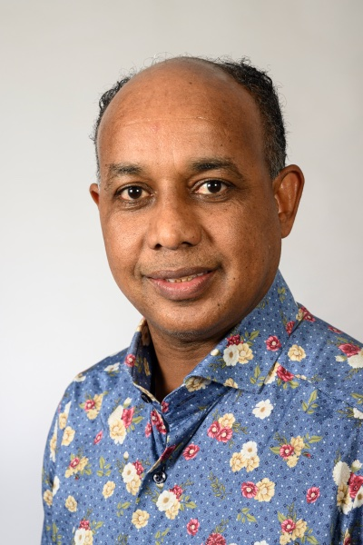
    <h4 class="member-name">Binyam Afewerk Demena</h4>
    <p class="member-uni">ISS, Erasmus University Rotterdam</p>
    <a class="member-link" href="https://www.eur.nl/en/people/binyam-afewerk-demena" target="_blank" rel="noopener" title="Personal page" aria-label="Personal page of Binyam Afewerk Demena">
      </a>
  </div>

  <div class="member-card" data-uni="radboud">
    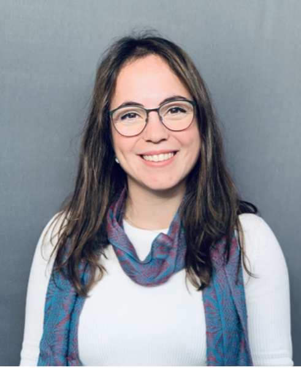
    <h4 class="member-name">Lisa van Dongen</h4>
    <p class="member-uni">Radboud University</p>
    <a class="member-link" href="https://www.ru.nl/en/people/dongen-e-m-van" target="_blank" rel="noopener" title="Personal page" aria-label="Personal page of Lisa van Dongen">
      </a>
  </div>

  <div class="member-card" data-uni="erasmus">
    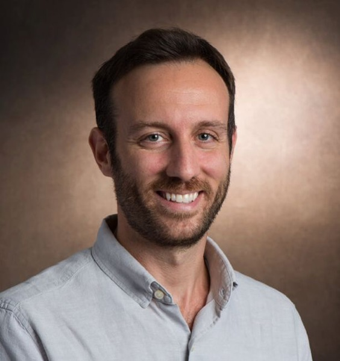
    <h4 class="member-name">Aksel Erbahar</h4>
    <p class="member-uni">Erasmus University Rotterdam</p>
    <a class="member-link" href="https://www.eur.nl/en/people/aksel-erbahar" target="_blank" rel="noopener" title="Personal page" aria-label="Personal page of Aksel Erbahar">
      </a>
  </div>

  <div class="member-card" data-uni="tilburg">
    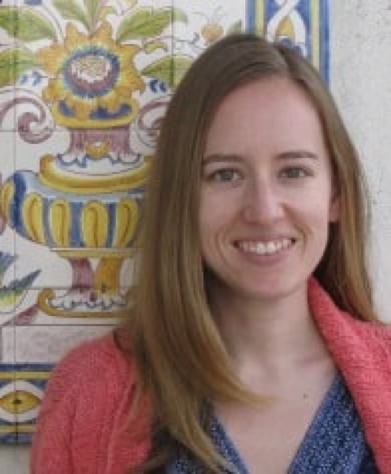
    <h4 class="member-name">Mery Ferrando</h4>
    <p class="member-uni">Tilburg University</p>
    <a class="member-link" href="https://sites.google.com/view/meryferrando" target="_blank" rel="noopener" title="Personal page" aria-label="Personal page of Mery Ferrando">
      </a>
  </div>

  <div class="member-card" data-uni="tilburg">
    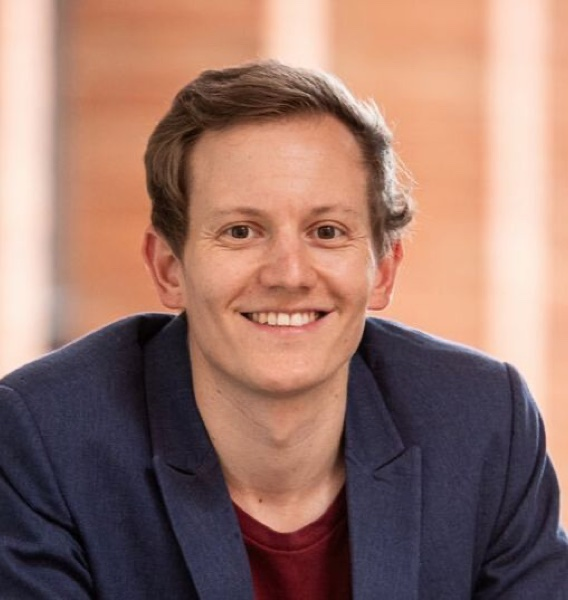
    <h4 class="member-name">Jonas Gathen</h4>
    <p class="member-uni">Tilburg University</p>
    <a class="member-link" href="https://www.jonasgathen.com/" target="_blank" rel="noopener" title="Personal page" aria-label="Personal page of Jonas Gathen">
      </a>
  </div>

  <div class="member-card" data-uni="wageningen">
    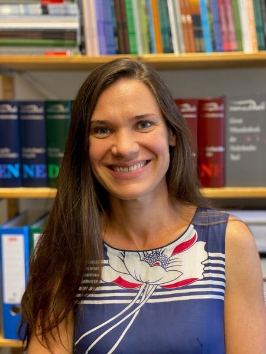
    <h4 class="member-name">Esther Gehrke</h4>
    <p class="member-uni">Wageningen University</p>
    <a class="member-link" href="https://www.esthergehrke.com/" target="_blank" rel="noopener" title="Personal page" aria-label="Personal page of Esther Gehrke">
      </a>
  </div>

  <div class="member-card" data-uni="erasmus">
    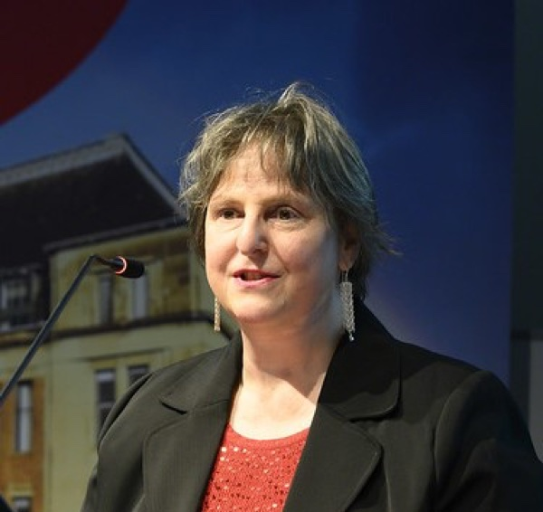
    <h4 class="member-name">Georgina M. Gómez</h4>
    <p class="member-uni">ISS, Erasmus University Rotterdam</p>
    <a class="member-link" href="https://www.eur.nl/en/people/georgina-gomez" target="_blank" rel="noopener" title="Personal page" aria-label="Personal page of Georgina M. Gómez">
      </a>
  </div>

  <div class="member-card" data-uni="wageningen">
    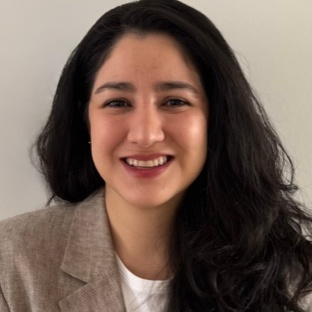
    <h4 class="member-name">Michelle González Amador</h4>
    <p class="member-uni">Wageningen University</p>
    <a class="member-link" href="https://www.m-gonzalezamador.com" target="_blank" rel="noopener" title="Personal page" aria-label="Personal page of Michelle González Amador">
      </a>
  </div>

  <div class="member-card" data-uni="wageningen">
    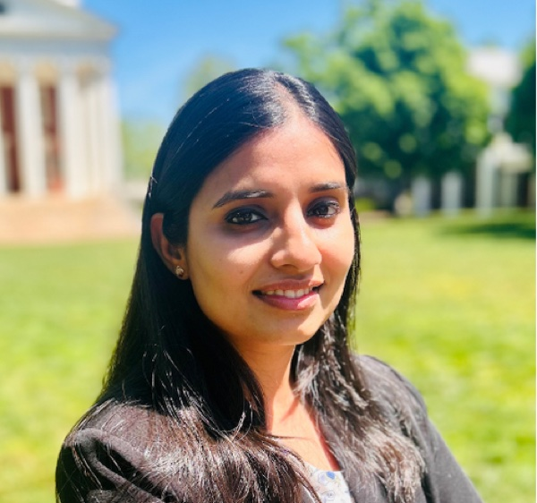
    <h4 class="member-name">Ritika Gupta</h4>
    <p class="member-uni">Wageningen University</p>
    <a class="member-link" href="https://research.wur.nl/en/persons/ritika-gupta" target="_blank" rel="noopener" title="Personal page" aria-label="Personal page of Ritika Gupta">
      </a>
  </div>

  <div class="member-card" data-uni="wageningen">
    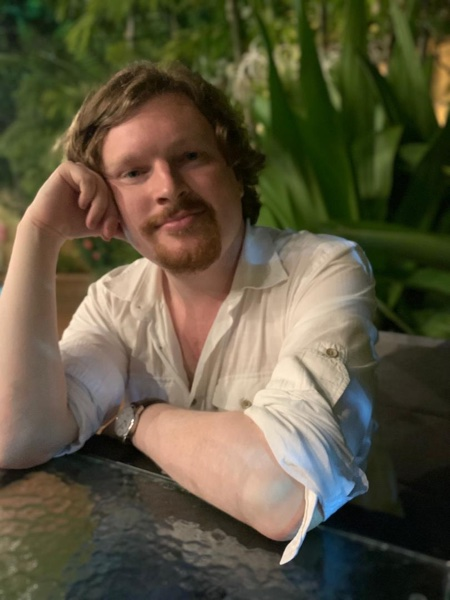
    <h4 class="member-name">Calumn Hamilton</h4>
    <p class="member-uni">Wageningen University</p>
    <a class="member-link" href="https://www.wur.nl/en/persons/cg-calumn-hamilton" target="_blank" rel="noopener" title="Personal page" aria-label="Personal page of Calumn Hamilton">
      </a>
  </div>

  <div class="member-card" data-uni="vu">
    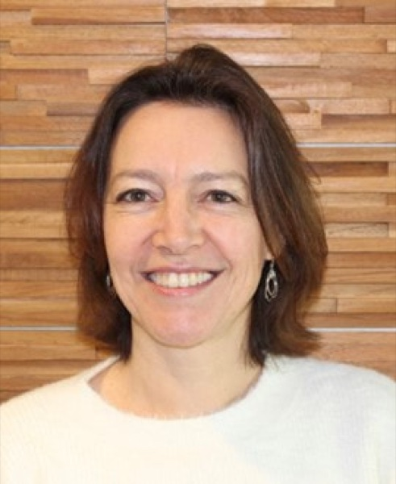
    <h4 class="member-name">Wendy Janssens</h4>
    <p class="member-uni">VU Amsterdam</p>
    <a class="member-link" href="https://research.vu.nl/en/persons/wendy-janssens" target="_blank" rel="noopener" title="Personal page" aria-label="Personal page of Wendy Janssens">
      </a>
  </div>

  <div class="member-card" data-uni="vu">
    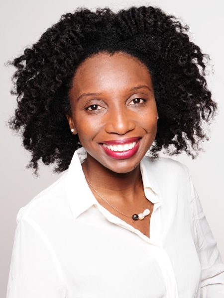
    <h4 class="member-name">Kacana Khadjavi</h4>
    <p class="member-uni">VU Amsterdam</p>
    <a class="member-link" href="https://kacanasipangule.wordpress.com/" target="_blank" rel="noopener" title="Personal page" aria-label="Personal page of Kacana Khadjavi">
      </a>
  </div>

  <div class="member-card" data-uni="radboud">
    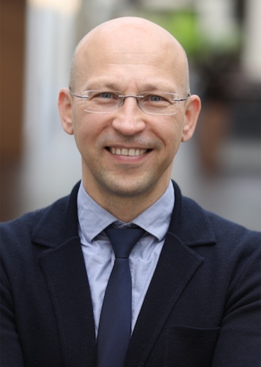
    <h4 class="member-name">Olexiy Kyrychenko</h4>
    <p class="member-uni">Radboud University</p>
    <a class="member-link" href="https://www.ru.nl/en/people/kyrychenko-o" target="_blank" rel="noopener" title="Personal page" aria-label="Personal page of Olexiy Kyrychenko">
      </a>
  </div>

  <div class="member-card" data-uni="wageningen">
    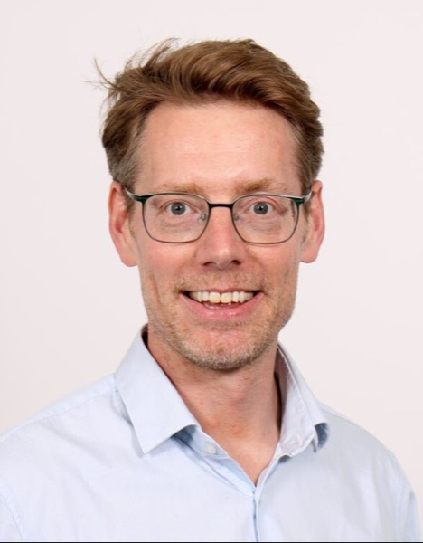
    <h4 class="member-name">Joost de Laat</h4>
    <p class="member-uni">Wageningen University</p>
    <a class="member-link" href="https://research.wur.nl/en/persons/joost-de-laat/" target="_blank" rel="noopener" title="Personal page" aria-label="Personal page of Joost de Laat">
      </a>
  </div>

  <div class="member-card" data-uni="vu">
    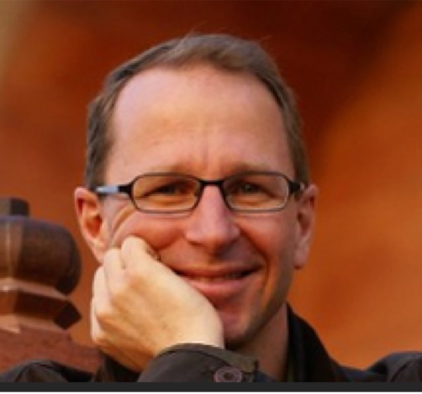
    <h4 class="member-name">Peter Lanjouw</h4>
    <p class="member-uni">VU Amsterdam</p>
    <a class="member-link" href="https://research.vu.nl/en/persons/pf-lanjouw" target="_blank" rel="noopener" title="Personal page" aria-label="Personal page of Peter Lanjouw">
      </a>
  </div>

  <div class="member-card" data-uni="groningen">
    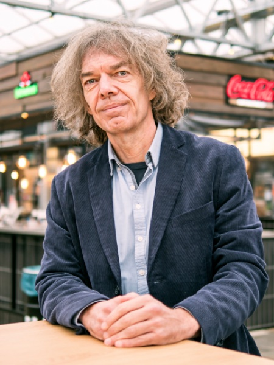
    <h4 class="member-name">Robert Lensink</h4>
    <p class="member-uni">University of Groningen</p>
    <a class="member-link" href="https://www.rug.nl/staff/b.w.lensink/" target="_blank" rel="noopener" title="Personal page" aria-label="Personal page of Robert Lensink">
      </a>
  </div>

  <div class="member-card" data-uni="vu">
    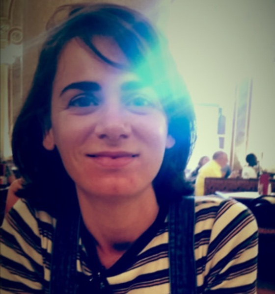
    <h4 class="member-name">Clotilde Mahé</h4>
    <p class="member-uni">VU Amsterdam</p>
    <a class="member-link" href="https://sites.google.com/view/clotildemahe" target="_blank" rel="noopener" title="Personal page" aria-label="Personal page of Clotilde Mahé">
      </a>
  </div>

  <div class="member-card" data-uni="unu-merit">
    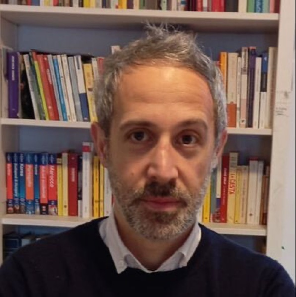
    <h4 class="member-name">Bruno Martorano</h4>
    <p class="member-uni">UNU-MERIT</p>
    <a class="member-link" href="https://unu.edu/merit/about/expert/dr-bruno-martorano" target="_blank" rel="noopener" title="Personal page" aria-label="Personal page of Bruno Martorano">
      </a>
  </div>

  <div class="member-card" data-uni="radboud">
    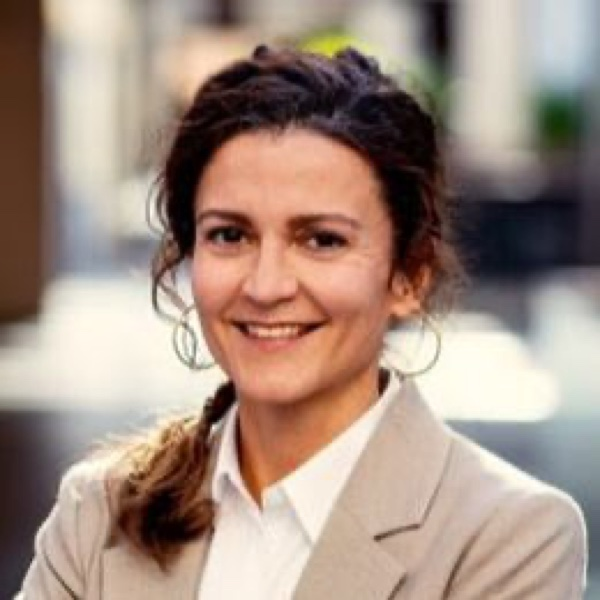
    <h4 class="member-name">Laura Metzger</h4>
    <p class="member-uni">Radboud University</p>
  </div>

  <div class="member-card" data-uni="groningen">
    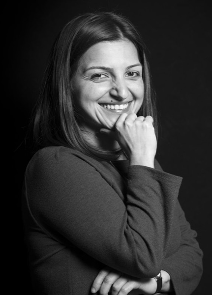
    <h4 class="member-name">Anna Minasyan</h4>
    <p class="member-uni">University of Groningen</p>
    <a class="member-link" href="https://www.rug.nl/staff/a.minasyan/" target="_blank" rel="noopener" title="Personal page" aria-label="Personal page of Anna Minasyan">
      </a>
  </div>

  <div class="member-card" data-uni="utrecht">
    
    <h4 class="member-name">Karlijn Morsink</h4>
    <p class="member-uni">Utrecht University</p>
    <a class="member-link" href="https://www.karlijnmorsink.com/" target="_blank" rel="noopener" title="Personal page" aria-label="Personal page of Karlijn Morsink">
      </a>
  </div>

  <div class="member-card" data-uni="groningen">
    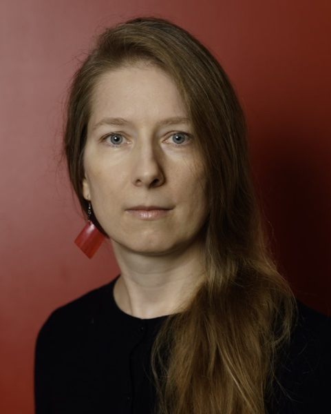
    <h4 class="member-name">Annika Mueller</h4>
    <p class="member-uni">University of Groningen</p>
    <a class="member-link" href="https://research.rug.nl/en/persons/annika-mueller" target="_blank" rel="noopener" title="Personal page" aria-label="Personal page of Annika Mueller">
      </a>
  </div>

  <div class="member-card" data-uni="erasmus">
    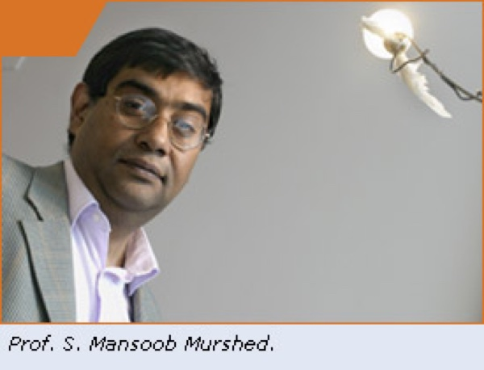
    <h4 class="member-name">Syed Mansoob Murshed</h4>
    <p class="member-uni">ISS, Erasmus University Rotterdam</p>
    <a class="member-link" href="https://www.eur.nl/en/people/mansoob-murshed" target="_blank" rel="noopener" title="Personal page" aria-label="Personal page of Syed Mansoob Murshed">
      </a>
  </div>

  <div class="member-card" data-uni="unu-merit">
    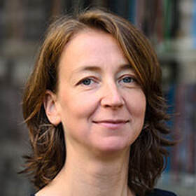
    <h4 class="member-name">Eleonora Nillesen</h4>
    <p class="member-uni">UNU-MERIT</p>
    <a class="member-link" href="https://unu.edu/merit/about/expert/prof-dr-eleonora-nillesen" target="_blank" rel="noopener" title="Personal page" aria-label="Personal page of Eleonora Nillesen">
      </a>
  </div>

  <div class="member-card" data-uni="vu">
    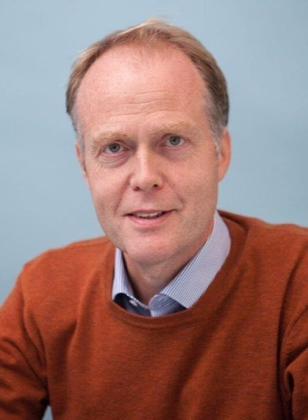
    <h4 class="member-name">Remco Oostendorp</h4>
    <p class="member-uni">VU Amsterdam</p>
    <a class="member-link" href="https://research.vu.nl/en/persons/remco-oostendorp" target="_blank" rel="noopener" title="Personal page" aria-label="Personal page of Remco Oostendorp">
      </a>
  </div>

  <div class="member-card" data-uni="groningen">
    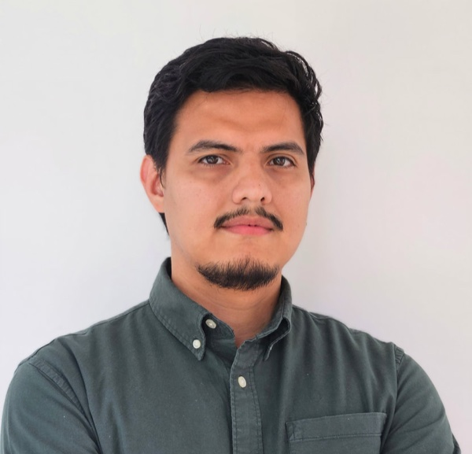
    <h4 class="member-name">Marcello Perez</h4>
    <p class="member-uni">University of Groningen</p>
    <a class="member-link" href="https://research.rug.nl/en/persons/marcello-perez-alvarez" target="_blank" rel="noopener" title="Personal page" aria-label="Personal page of Marcello Perez">
      </a>
  </div>

  <div class="member-card" data-uni="vu">
    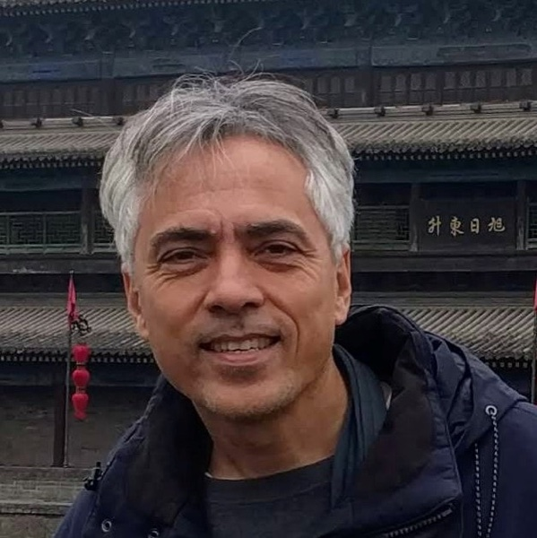
    <h4 class="member-name">Menno Pradhan</h4>
    <p class="member-uni">VU Amsterdam & UvA</p>
    <a class="member-link" href="https://research.vu.nl/en/persons/menno-pradhan" target="_blank" rel="noopener" title="Personal page" aria-label="Personal page of Menno Pradhan">
      </a>
  </div>

  <div class="member-card" data-uni="erasmus">
    
    <h4 class="member-name">Matthias Rieger</h4>
    <p class="member-uni">Erasmus University Rotterdam</p>
    <a class="member-link" href="https://www.eur.nl/en/people/matthias-rieger" target="_blank" rel="noopener" title="Personal page" aria-label="Personal page of Matthias Rieger">
      </a>
  </div>

  <div class="member-card" data-uni="wageningen">
    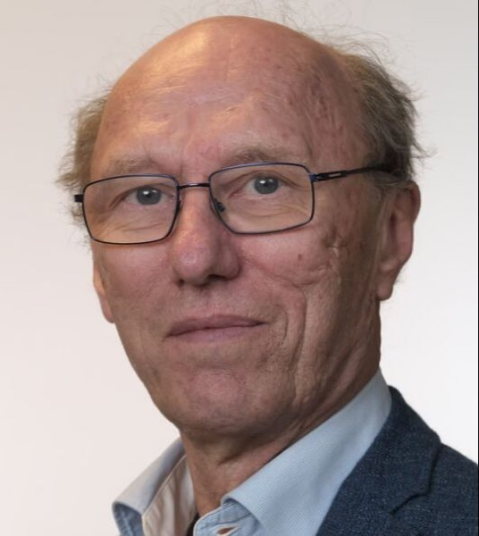
    <h4 class="member-name">Ruerd Ruben</h4>
    <p class="member-uni">Wageningen University</p>
    <a class="member-link" href="https://research.wur.nl/en/persons/ruerd-ruben" target="_blank" rel="noopener" title="Personal page" aria-label="Personal page of Ruerd Ruben">
      </a>
  </div>

  <div class="member-card" data-uni="groningen">
    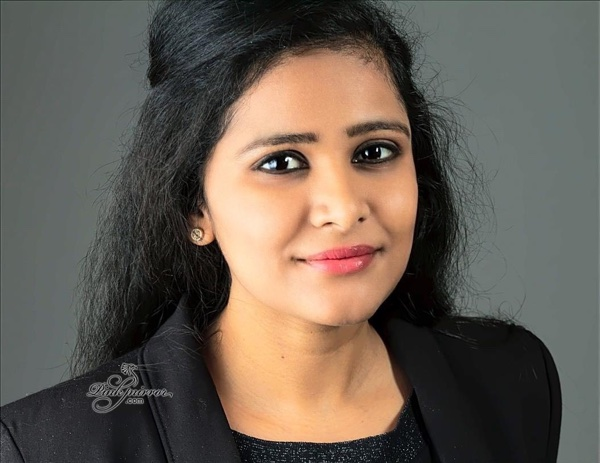
    <h4 class="member-name">Kritika Saxena</h4>
    <p class="member-uni">University of Groningen</p>
    <a class="member-link" href="https://www.rug.nl/staff/k.saxena/" target="_blank" rel="noopener" title="Personal page" aria-label="Personal page of Kritika Saxena">
      </a>
  </div>

  <div class="member-card" data-uni="erasmus">
    
    <h4 class="member-name">Zemzem Shigute Shuka</h4>
    <p class="member-uni">ISS, Erasmus University Rotterdam</p>
    <a class="member-link" href="https://www.eur.nl/en/people/zemzem-shigute-shuka" target="_blank" rel="noopener" title="Personal page" aria-label="Personal page of Zemzem Shigute Shuka">
      </a>
  </div>

  <div class="member-card" data-uni="tilburg">
    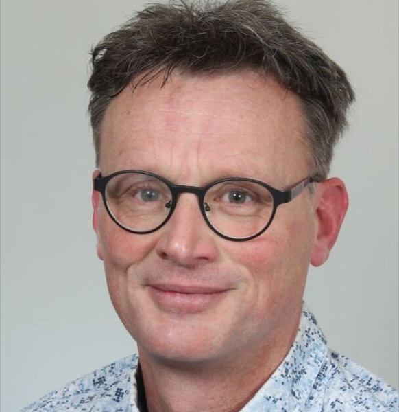
    <h4 class="member-name">Daan van Soest</h4>
    <p class="member-uni">Tilburg University</p>
    <a class="member-link" href="https://sites.google.com/site/daanvansoest/" target="_blank" rel="noopener" title="Personal page" aria-label="Personal page of Daan van Soest">
      </a>
  </div>

  <div class="member-card" data-uni="wageningen">
    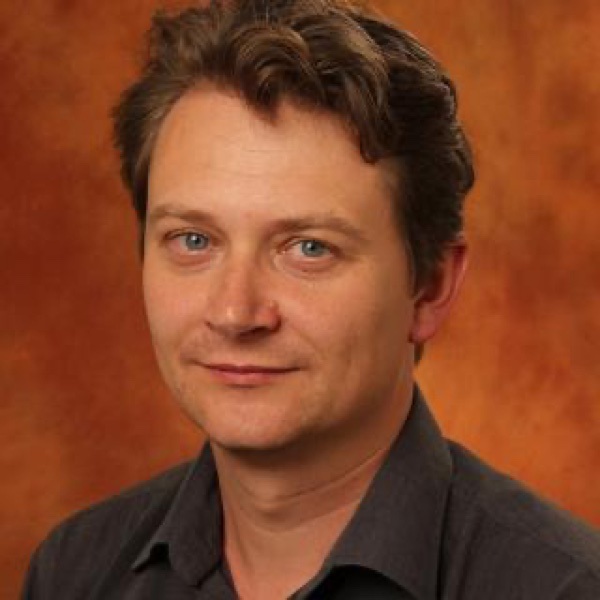
    <h4 class="member-name">Robert Sparrow</h4>
    <p class="member-uni">Wageningen University</p>
    <a class="member-link" href="https://www.wur.nl/en/persons/dr-ra-robert-sparrow" target="_blank" rel="noopener" title="Personal page" aria-label="Personal page of Robert Sparrow">
      </a>
  </div>

  <div class="member-card" data-uni="erasmus">
    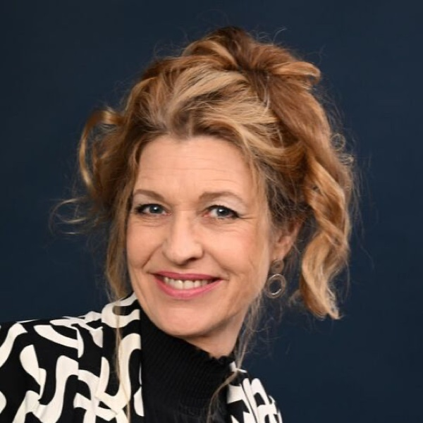
    <h4 class="member-name">Irene van Staveren</h4>
    <p class="member-uni">Erasmus University Rotterdam</p>
    <a class="member-link" href="https://www.eur.nl/en/people/irene-van-staveren" target="_blank" rel="noopener" title="Personal page" aria-label="Personal page of Irene van Staveren">
      </a>
  </div>

  <div class="member-card" data-uni="groningen">
    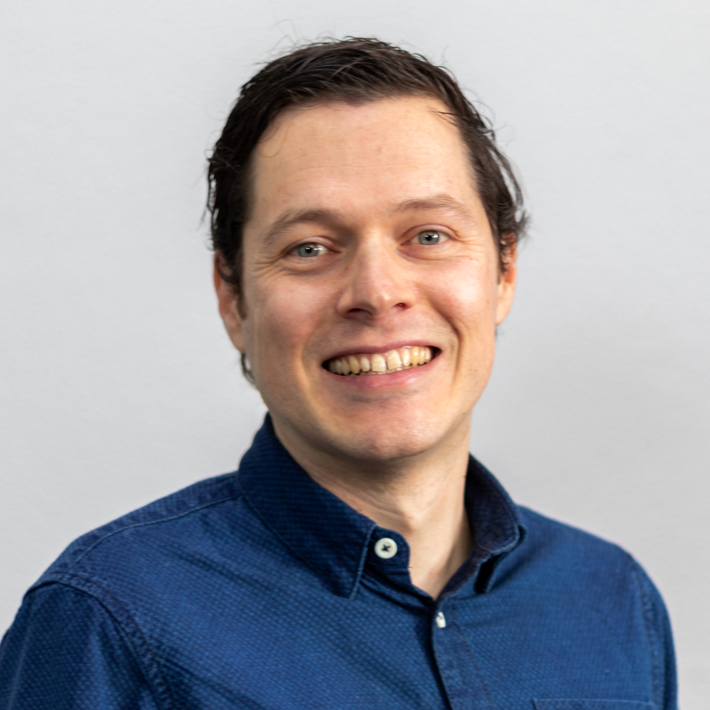
    <h4 class="member-name">Mark Treurniet</h4>
    <p class="member-uni">University of Groningen</p>
    <a class="member-link" href="https://marktreurniet.nl/" target="_blank" rel="noopener" title="Personal page" aria-label="Personal page of Mark Treurniet">
      </a>
  </div>

  <div class="member-card" data-uni="wageningen">
    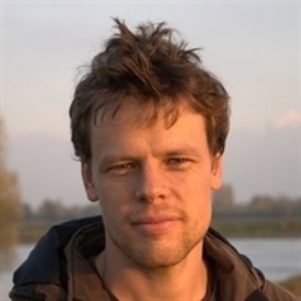
    <h4 class="member-name">Maarten Voors</h4>
    <p class="member-uni">Wageningen University</p>
    <a class="member-link" href="https://sites.google.com/site/maartenvoors/" target="_blank" rel="noopener" title="Personal page" aria-label="Personal page of Maarten Voors">
      </a>
  </div>

  <div class="member-card" data-uni="groningen">
    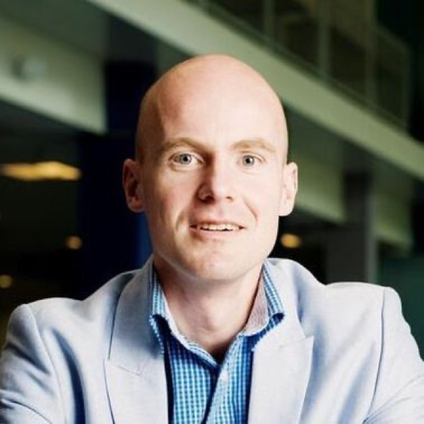
    <h4 class="member-name">Gaaitzen de Vries</h4>
    <p class="member-uni">University of Groningen</p>
    <a class="member-link" href="https://www.rug.nl/staff/g.j.de.vries/" target="_blank" rel="noopener" title="Personal page" aria-label="Personal page of Gaaitzen de Vries">
      </a>
  </div>

  <div class="member-card" data-uni="erasmus">
    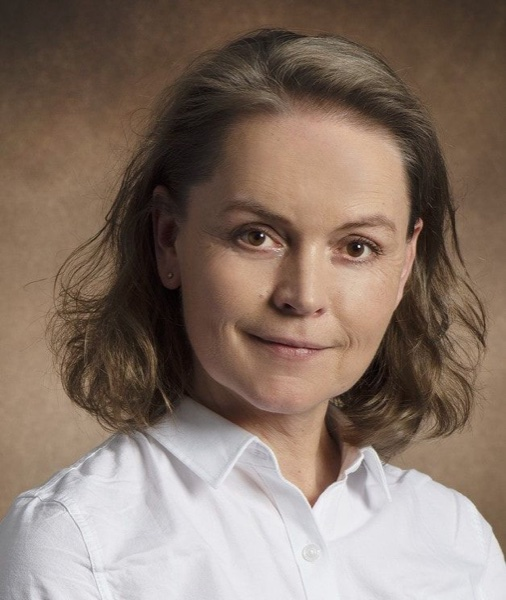
    <h4 class="member-name">Margarita de Vries Mecheva</h4>
    <p class="member-uni">Erasmus University Rotterdam</p>
    <a class="member-link" href="https://www.eur.nl/en/people/margarita-de-vries-mecheva" target="_blank" rel="noopener" title="Personal page" aria-label="Personal page of Margarita de Vries Mecheva">
      </a>
  </div>

  <div class="member-card" data-uni="radboud">
    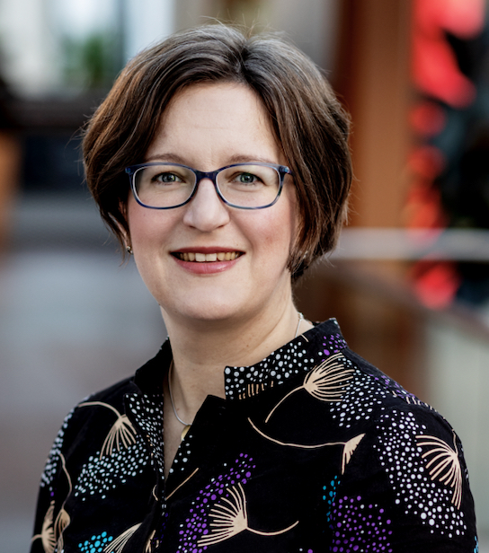
    <h4 class="member-name">Natascha Wagner</h4>
    <p class="member-uni">Radboud University</p>
    <a class="member-link" href="https://natascha-wagner.com/" target="_blank" rel="noopener" title="Personal page" aria-label="Personal page of Natascha Wagner">
      </a>
  </div>

  <div class="member-card" data-uni="vu">
    
    <h4 class="member-name">Marc Witte</h4>
    <p class="member-uni">VU Amsterdam</p>
    <a class="member-link" href="https://www.marcwitte.com/" target="_blank" rel="noopener" title="Personal page" aria-label="Personal page of Marc Witte">
      </a>
  </div>

</div>

<h3 class="members-h">PhD Candidates</h3>

<div class="phd-list">
  <div class="phd-block" data-uni="erasmus">
    <h4 class="phd-uni">Erasmus</h4>
    <p class="phd-names">Anandita Bardia · Ebenezer Kontoh · Ibeth Lopez Cazar · Nicola Mangraviti · Vinh Phan · Samer Srouji · Fantine Xiao · Zhiqi Xu</p>
  </div>

  <div class="phd-block" data-uni="groningen">
    <h4 class="phd-uni">Groningen</h4>
    <p class="phd-names">Yu Chen · Nauli Desdiani · Ade Febriady · Alexandra Geis · Kaira Gräler · Madeline Langley · Nathalia Maya · Sophie von Russdorf · Afroza Shimu · Deepakshi Singh · Claire Stein · Guanyang Wang · Abdeta Wokaya</p>
  </div>

  <div class="phd-block" data-uni="radboud">
    <h4 class="phd-uni">Radboud</h4>
    <p class="phd-names">Emily Bergner · Anne Lieke Ebbers · Fabeha Fabeha · Emiliano Hernandez Gomez Galvarriato · Haike Pijs · Jet Wildeman</p>
  </div>

  <div class="phd-block" data-uni="tilburg">
    <h4 class="phd-uni">Tilburg</h4>
    <p class="phd-names">Kian Abbas Nejad · Johanna Behrens · Túlio Bouzas · Polle Dankers · Julius Kaut · Shengyu Li · Marieke Meeske · Hezha Mohammedkhan · Carla De Oliveira Palacios · Natália Poláková · Juan Segnana · Claire Tan · Till Wicker</p>
  </div>

  <div class="phd-block" data-uni="unu-merit">
    <h4 class="phd-uni">UNU-MERIT</h4>
    <p class="phd-names">Paloma Assuncao · Rafael de la Vega · Ana Karen Diaz Mendez · Tobias Hillenbrand · Teresa Janz · Matilde João Mota · Praachi Kumar · Davide Manzoni · Yannick Markhof · Giovanna Mazzeo Ortolani · Lizeth Molina Alvarez · Manisha Mukherjee · Abdelrahman Nagy · Conrad Nunnenmacher · Ari Perdana · Trang Pham-Thi · Nathalia Ramirez · Stefanie Roost · Karthika Sujatha · Tiruwork Tadesse</p>
  </div>

  <div class="phd-block" data-uni="utrecht">
    <h4 class="phd-uni">Utrecht</h4>
    <p class="phd-names">Annika Brown · Anaya Dam · Samin Nikkah Bahrami · Jimena Pacheco Miranda · Mia Ravbar · Harry Hyuk Son · Anouk van Veldhoven · Enric Vila i de Villasante</p>
  </div>

  <div class="phd-block" data-uni="vu">
    <h4 class="phd-uni">VU Amsterdam</h4>
    <p class="phd-names">Nursena Aksünger · Peter Courtney · Diana Garcia Rojas · Yifu He · Philip Kollenda · Wei Li · Sally Odunga · Gerton Rongen · Philip Schirmer · Albena Sotirova · Else-Marie van den Herik · Monserrat Vasquez Ladron de Guevara</p>
  </div>

  <div class="phd-block" data-uni="wageningen">
    <h4 class="phd-uni">Wageningen</h4>
    <p class="phd-names">Fatma Abdelaziz Abdelkader · Stellamaris Aju · Emmanuel Bizimungu · Huayi Chang · Brian Chisanga · Ana Paula de la O Campos · Solomon Deffersha · Tai Deng · Malick Dione · Ishmael Edjekumhene · Mauricio Espinoza · Lotte van der Haar · Alvaro Hopkins Barriga · Paul Jasper · Yutong Jiao · Samyuktha Kannan · Linda Klunder · Sabrina Kuri Rodriguez · Gerald Lesseri · Jinghan Li · Kweyu Lutomia · Astrid Mastenbroek · Tomohisa Miyamoto · Michael Mulford · Davis Mwakanyamale · Jamleck Oroko · Neha Paliwal · Andhika Pratama · Emma Rikken · Michael Rozelle · Paul Schöpfer · Marwan el Solh · Rassoul Sy · Yeshimebet Tegenie · Emily ter Steeg · Clement Uwizeye · Marijn Voorhaar · Bedaso Wakeyo · Philip Wollburg · Ling Zhang</p>
  </div>

  <div class="phd-block" data-uni="tinbergen">
    <h4 class="phd-uni">Tinbergen Institute</h4>
    <p class="phd-names">Robin Aarts · Tijmen Henkes · Sarah Leuthold · Andrei Tuiu</p>
  </div>
</div>

<p class="member-note">Are you a development economist based in the Netherlands and would like to join the network? Contact <a href="../universities/index.html">your university's coordinator</a>.</p>

<script>
document.addEventListener('DOMContentLoaded', function () {
  var chips = document.querySelectorAll('.member-chip');
  var items = document.querySelectorAll('.member-card, .phd-block');

  chips.forEach(function (chip) {
    chip.addEventListener('click', function () {
      chips.forEach(function (c) { c.classList.remove('active'); });
      chip.classList.add('active');
      var filter = chip.dataset.filter;
      items.forEach(function (item) {
        item.classList.toggle('is-hidden', filter !== 'all' && item.dataset.uni !== filter);
      });
    });
  });
});
</script>
```
