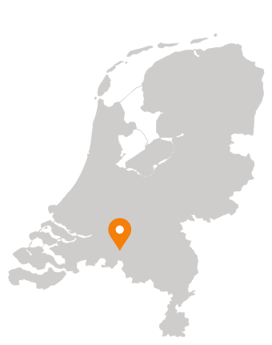
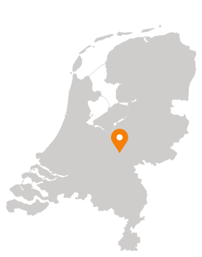
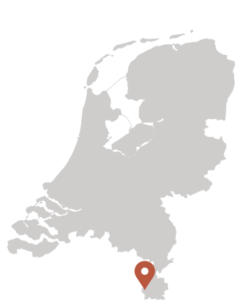
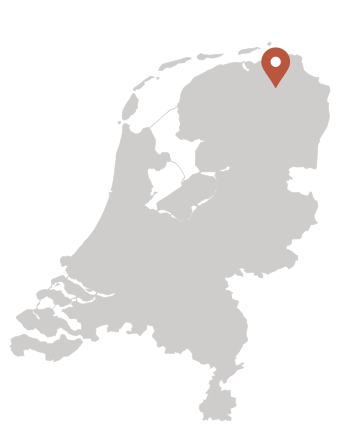
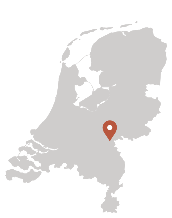
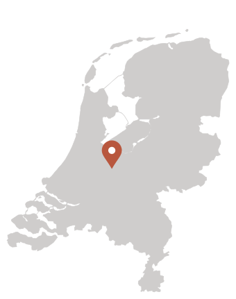
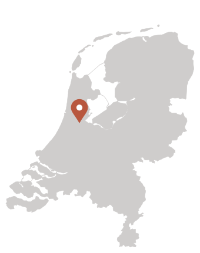

```{r}
#| include: false
library(htmltools)
```

::: {.grid-layout}

::: {.card-uni}
<!-- Title Row -->
:::{.full-title}
::: {.profile-title-box}
#### [**Tilburg University** Coordinator](https://www.tilburguniversity.edu/about/schools/economics-and-management/organization/departments/economics)
:::
:::

<!-- Images Row -->
<div class="card-uni-imgs">
  <span class="map-wrap"><a class="map-pin-link" style="left:44.0%; top:72.8%" href="https://www.google.com/maps/search/?api=1&amp;query=Tilburg+University" target="_blank" rel="noopener" title="Open Tilburg University in Google Maps" aria-label="Open Tilburg University in Google Maps"></a></span>
  
</div>

<!-- Description Row -->
<div class="full-text">
  <p><strong>Patricio Dalton</strong>, Associate Professor of Economics.</p>
</div>

<!-- Links Row -->
<div class="full-icons">
  <a href="https://x.com/daltonpato" target="_blank" title="X">
    
  </a>
  <a href="mailto:p.s.dalton@uvt.nl" title="Email">
    
  </a>
  <a href="https://sites.google.com/site/psdalton/home" target="_blank" title="Website">
    
  </a>
  <a href="https://www.linkedin.com/in/patricio-dalton-b9578a37/" target="_blank" title="LinkedIn">
    
  </a>
</div>

:::

::: {.card-uni}
<!-- Title Row -->
:::{.full-title}
::: {.profile-title-box}
#### [**Wageningen University** Coordinator](https://www.wur.nl/en/research-results/chair-groups/social-sciences/development-economics-group.htm)
:::
:::

<!-- Images Row -->
<div class="card-uni-imgs">
  <span class="map-wrap"><a class="map-pin-link" style="left:59.2%; top:59.6%" href="https://www.google.com/maps/search/?api=1&amp;query=Wageningen+University" target="_blank" rel="noopener" title="Open Wageningen University in Google Maps" aria-label="Open Wageningen University in Google Maps"></a></span>
  
</div>

<!-- Description Row -->
<div class="full-text">
  <p><strong>Francesco Cecchi</strong>, Associate Professor of Development Economics.</p>
</div>

<!-- Links Row -->
<div class="full-icons">
  <a href="mailto:francesco.cecchi@wur.nl" title="Email">
    
  </a>
  <a href="https://sites.google.com/view/francescocecchi" target="_blank" title="Website">
    
  </a>
  <a href="https://www.linkedin.com/in/francesco-cecchi/" target="_blank" title="LinkedIn">
    
  </a>
</div>

:::

::: {.card-uni}
<!-- Title Row -->
:::{.full-title}
::: {.profile-title-box}
#### [**UNU-MERIT** Coordinator](https://unu.edu/merit)
:::
:::

<!-- Images Row -->
<div class="card-uni-imgs">
  <span class="map-wrap"><a class="map-pin-link" style="left:59.8%; top:94.5%" href="https://www.google.com/maps/search/?api=1&amp;query=UNU-MERIT+Maastricht" target="_blank" rel="noopener" title="Open UNU-MERIT in Google Maps" aria-label="Open UNU-MERIT in Google Maps"></a></span>
  
</div>

<!-- Description Row -->
<div class="full-text">
  <p><strong>Eleonora Nillesen</strong>, Professor of Public Policy and Development.</p>
</div>

<!-- Links Row -->
<div class="full-icons">
  <a href="mailto:nillesen@merit.unu.edu" title="Email">
    
  </a>
  <a href="https://unu.edu/merit/about/expert/prof-dr-eleonora-nillesen" target="_blank" title="Website">
    
  </a>
</div>

:::

::: {.card-uni}
<!-- Title Row -->
:::{.full-title}
::: {.profile-title-box}
#### [**Groningen University** Coordinator](https://www.rug.nl/feb/?lang=en)
:::
:::

<!-- Images Row -->
<div class="card-uni-imgs">
  <span class="map-wrap"><a class="map-pin-link" style="left:81.1%; top:20.5%" href="https://www.google.com/maps/search/?api=1&amp;query=University+of+Groningen" target="_blank" rel="noopener" title="Open University of Groningen in Google Maps" aria-label="Open University of Groningen in Google Maps"></a></span>
  
</div>

<!-- Description Row -->
<div class="full-text">
  <p><strong>Mark Treurniet</strong>, Assistant Professor at the Faculty of Economics.</p>
</div>

<!-- Links Row -->
<div class="full-icons">
  <a href="mailto:m.treurniet@rug.nl" title="Email">
    
  </a>
  <a href="https://marktreurniet.nl/" target="_blank" title="Website">
    
  </a>
  <a href="https://www.linkedin.com/in/mark-treurniet-aab03371/" target="_blank" title="LinkedIn">
    
  </a>
</div>

:::

::: {.card-uni}
<!-- Title Row -->
:::{.full-title}
::: {.profile-title-box}
#### [**Radboud University** Coordinator](https://www.ru.nl/en/departments/nijmegen-school-of-management/department-of-economics-and-business-economics)
:::
:::

<!-- Images Row -->
<div class="card-uni-imgs">
  <span class="map-wrap"><a class="map-pin-link" style="left:63.8%; top:64.8%" href="https://www.google.com/maps/search/?api=1&amp;query=Radboud+University+Nijmegen" target="_blank" rel="noopener" title="Open Radboud University in Google Maps" aria-label="Open Radboud University in Google Maps"></a></span>
  
</div>

<!-- Description Row -->
<div class="full-text">
  <p><strong>Natascha Wagner</strong>, Professor of Applied Economics and Development.</p>
</div>

<!-- Links Row -->
<div class="full-icons">
  <a href="mailto:natascha.wagner@ru.nl" title="Email">
    
  </a>
  <a href="https://natascha-wagner.com/" target="_blank" title="Website">
    
  </a>
  <a href="https://www.linkedin.com/in/natascha-wagner-3299a221/" target="_blank" title="LinkedIn">
    
  </a>
</div>

:::


::: {.card-uni}
<!-- Title Row -->
:::{.full-title}
::: {.profile-title-box}
#### [**Utrecht University** Coordinator](https://www.uu.nl/en/organisation/utrecht-university-school-of-economics-use)
:::
:::

<!-- Images Row -->
<div class="card-uni-imgs">
  <span class="map-wrap"><a class="map-pin-link" style="left:47.4%; top:56.5%" href="https://www.google.com/maps/search/?api=1&amp;query=Utrecht+University" target="_blank" rel="noopener" title="Open Utrecht University in Google Maps" aria-label="Open Utrecht University in Google Maps"></a></span>
  
</div>

<!-- Description Row -->
<div class="full-text">
  <p><strong>Karlijn Morsink</strong>, Associate Professor of Economics.</p>
</div>

<!-- Links Row -->
<div class="full-icons">
  <a href="https://x.com/karlijnmorsink" target="_blank" title="X">
    
  </a>
  <a href="mailto:k.morsink@uu.nl" title="Email">
    
  </a>
  <a href="https://www.karlijnmorsink.com/" target="_blank" title="Website">
    
  </a>
  <a href="https://www.linkedin.com/in/karlijnmorsink/" target="_blank" title="LinkedIn">
    
  </a>
</div>

:::

::: {.card-uni}
<!-- Title Row -->
:::{.full-title}
::: {.profile-title-box}
#### [**VU Amsterdam** Coordinator](https://vu.nl/en/about-vu/faculties/school-of-business-and-economics/departments/economics)
:::
:::

<!-- Images Row -->
<div class="card-uni-imgs">
  <span class="map-wrap"><a class="map-pin-link" style="left:39.7%; top:48.7%" href="https://www.google.com/maps/search/?api=1&amp;query=Vrije+Universiteit+Amsterdam" target="_blank" rel="noopener" title="Open VU Amsterdam in Google Maps" aria-label="Open VU Amsterdam in Google Maps"></a></span>
  
</div>

<!-- Description Row -->
<div class="full-text">
  <p><strong>Marc Witte</strong>, Assistant Professor in the Economics Department.</p>
</div>

<!-- Links Row -->
<div class="full-icons">
  <a href="https://x.com/marcjosefwitte" target="_blank" title="X">
    
  </a>
  <a href="https://bsky.app/profile/marcjosefwitte.bsky.social" target="_blank" title="BlueSky">
    
  </a>
  <a href="mailto:m.j.witte@vu.nl" title="Email">
    
  </a>
  <a href="https://www.marcwitte.com/" target="_blank" title="Website">
    
  </a>
  <a href="https://www.linkedin.com/in/marc-witte-7a922b70/" target="_blank" title="LinkedIn">
    
  </a>
</div>

:::


:::
